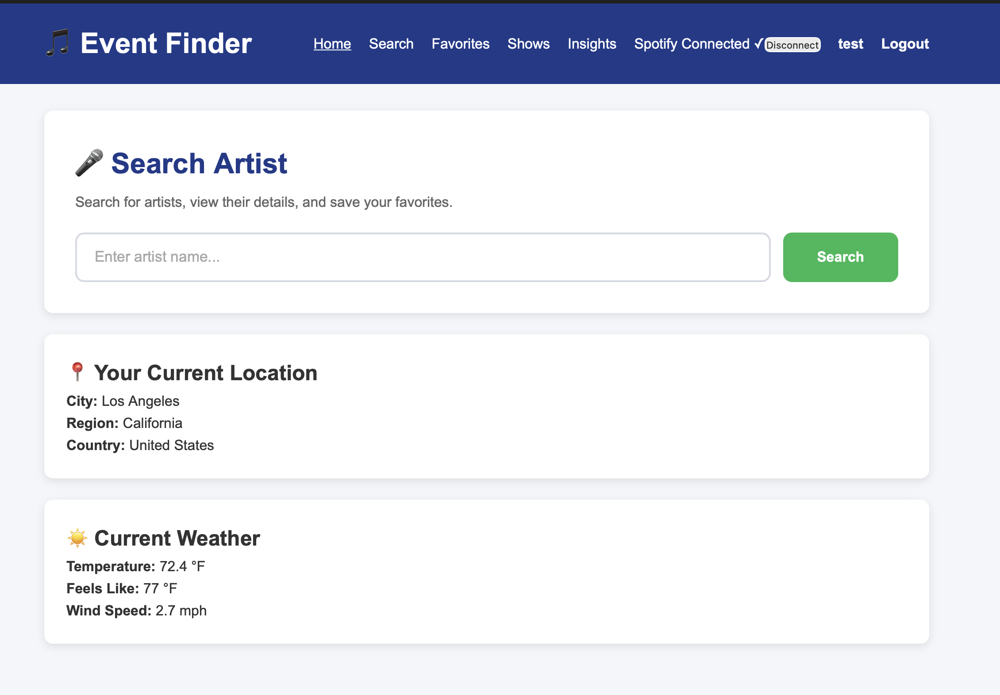
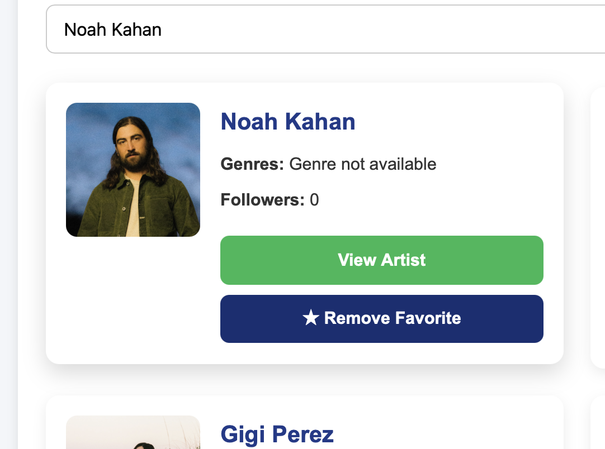
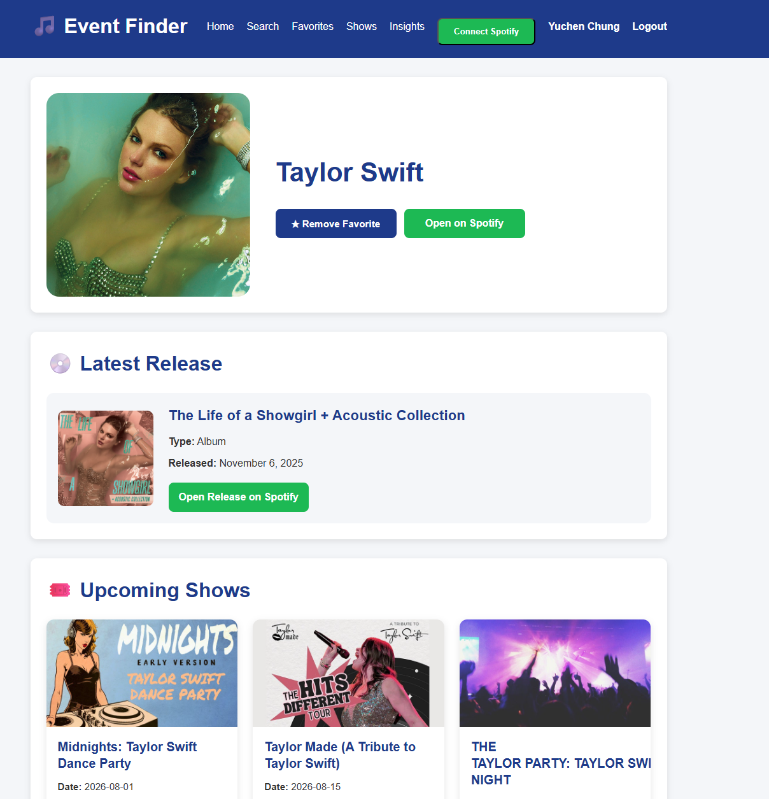
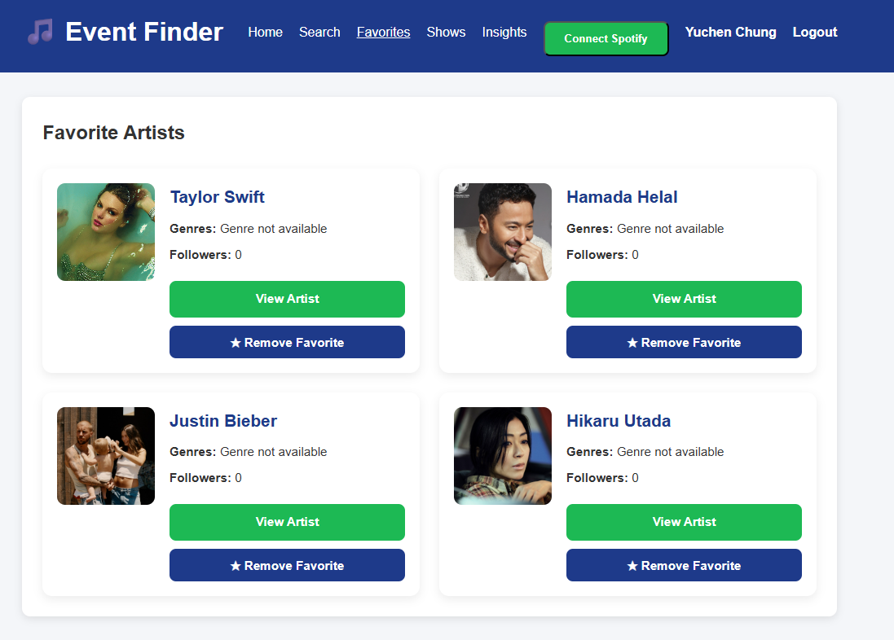
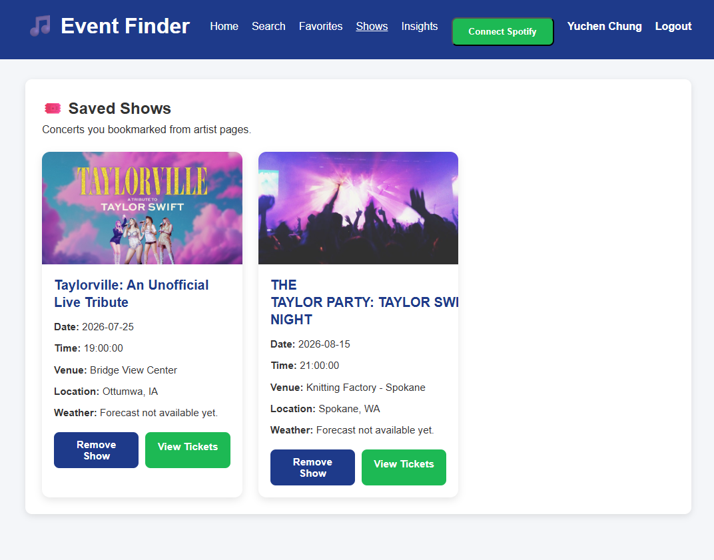
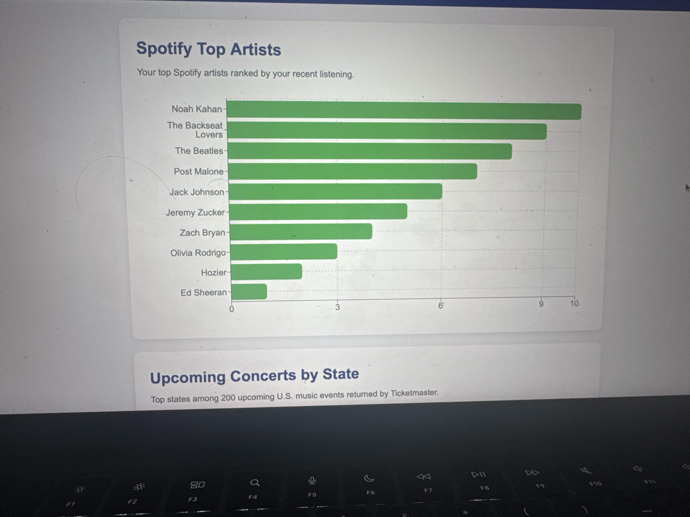
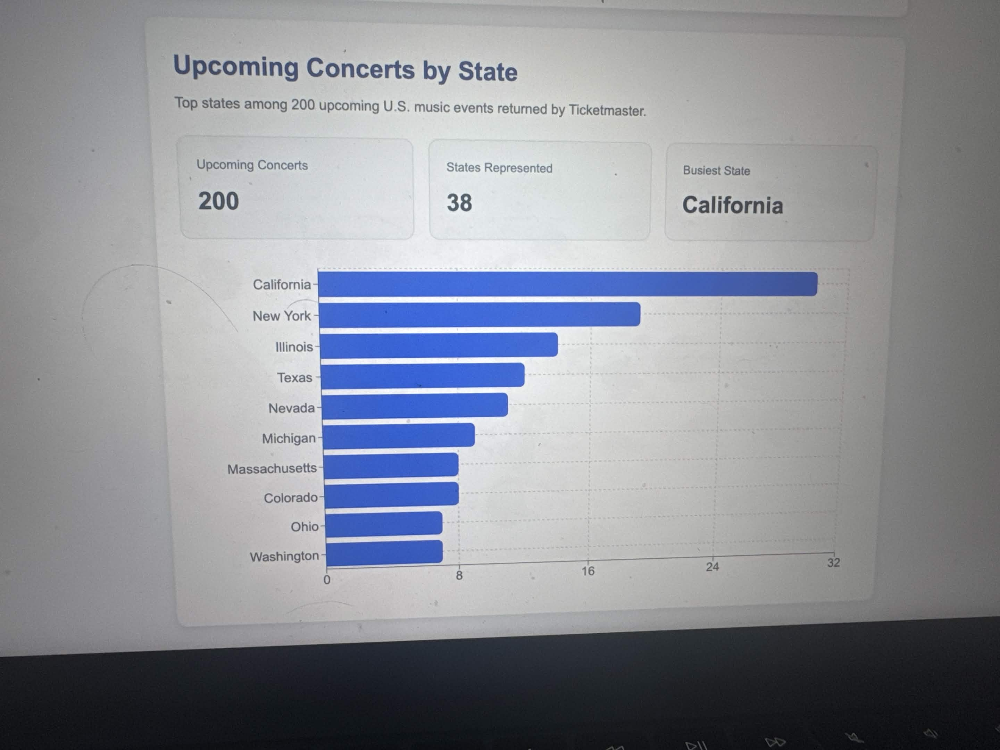

# CPSC 349 Final Project
### California State University, Fullerton
## 🎵 Event Finder – Music Discoery & Live Concert Tracker


## Project Members

YuChen Chung  
Luc Brown  
Luis E. Aldana Jr.  

## Project Overview

Event Finder is a web application that helps users discover music artists, upcoming concerts, and personalized music insights. Users can search for artists, view artist information, save favorite artists, and explore upcoming concert statistics.

## Features

- Search for music artists
- View artist details and information
- Save and remove favorite artists
- User authentication with Firebase
- Upcoming concerts by state
- Concert statistics dashboard
- Responsive design for desktop, tablet, and mobile devices

## Technologies Used

- React
- Vite
- JavaScript
- Firebase Authentication
- Firestore Database
- Express.js
- Render
- Firebase Hosting
- Recharts

## APIs Used

### 1. Spotify Web API (Authenticated)
- Search artists
- Display artist information
- OAuth support for personalized features

### 2. Ticketmaster Discovery API
- Retrieve upcoming concert events
- Generate concert statistics by state

### 3. IP-API / Open-Meteo API (Keyless)
- Detect user location
- Display local weather information

## Pages

- Home
- Artist Search
- Artist Details
- Favorites
- Insights

## Data Visualization

- Top Artists Bar Chart (Spotify)
- Upcoming Concerts by State Bar Chart
- Dashboard summary cards showing:
  - Total concerts
  - States represented
  - Busiest state

## User Authentication

Firebase Authentication supports:

- Email and Password Sign Up
- Email and Password Login
- Google Sign In
- Logout

User favorites are stored in Firestore and persist across sessions.

## Responsive Design

The application is optimized for:

- Desktop
- Tablet
- Mobile

## Installation

Clone the repository:

```bash
git clone <repository-url>
```

Install dependencies:

```bash
npm install
```

Run the frontend:

```bash
npm run dev
```

Run the backend:

```bash
node server.js
```

## Deployment

Frontend (Firebase Hosting)

https://cpsc349-project-1a474.web.app

Backend (Render)

https://music-discovery-app-cp0k.onrender.com

## GitHub Repository

https://github.com/csuf-cpsc349-summer2026/Project-YuChen-Luc-Luis.git

## Screenshots

## Screenshots

### Home Page



### Search Page



### Artist Details



### Favorite Artists



### Saved Shows



### Top Artists Chart



### Concerts by State Chart




    
